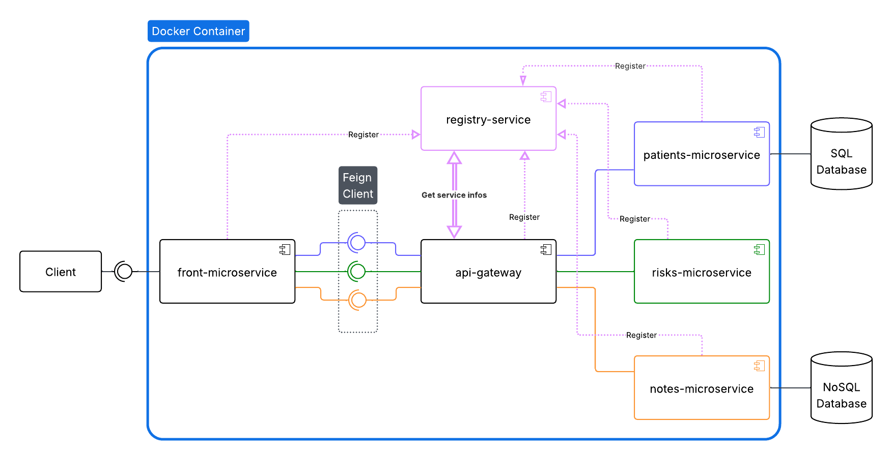

# Medilabo
MediLabo is a Java web application meant to facilitate detection of type-2 diabetes by calculating Risk Level. It is based on a micro-services architecture, with modules dedicated to model domains. It can be run as a Docker Compose container.  
It was built as part of the Java Developer OpenClassrooms course.

## Prerequisites
- Java 17
- Spring Boot 3.5.0
- Maven 3.9.9  
Versions can also be found in the parent [pom file](medi-labo/pom.xml).

## Architecture
There are 6 modules :
- front-service is the UI, exposing port 8080.
- gateway-service is a Spring Cloud Gateway
- registry-service is a Eureka Server to which all services register
- patients-service is a back-end service that communicates with a MySQL database
- notes-service is a back-end service that communicates with a MongoDB database
- risks-service is a back-end service for assessment that gathers data from the two other back-end services to calculate the risk level.

## Security
All services are using Spring Security, with HTTP Basic for authentication. For the development phase, a unique user is set in each service properties file. This feature must absolutely be updated to a proper user management before production.

## Databases
Two database systems are used: MySQL for patient objects, and MongoDB for note objects. For each of them, two DB are used: a 'prod' database and a 'test' database.
### MySQL set-up
Use the medilabo.sql file located in patient-service/src/main/resources/data to create the DB, table, and insert sample data.
Also use the medilabo_test.sql to create the database that will be used for testing.
### MongoDB set-up
Mongo Database Tool mongorestore on the two directories located in notes-service/src/main/resources/data will create databases and collections, and insert sample data.

## Run with Docker
The application can be run in a Docker Compose container using the compose.yaml file provided [here](medi-labo/compose.yaml). It builds each module and generates artifacts.  
Alternatively, each module can be run separately using their Dockerfile, provided that the artifact is built before.

## Green Code
With environment protection in mind, it would be advisable to apply Green Code principles to this project. To do so, a thorough analysis should be run on the project using tools such as EcoIndex or Ecometer.  
Moreover, several optimization possibilities should be investigated:
- Limit DB calls to a minimum
- Limit requests between services to a minimum
- Mindful choice of hosting